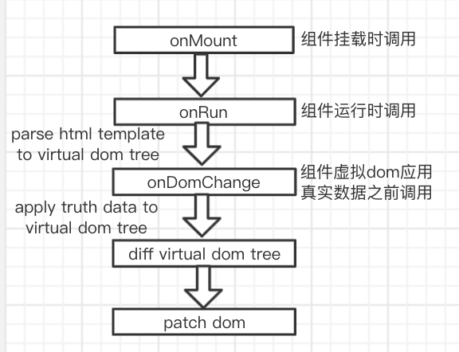

# yrv.js 一个 JavaScript 框架

## 无任何依赖

## 虚拟 dom

## 数据驱动视图更新

## 声明式组件化

## HTML 语法声明组件

## 使用方法:

安装:

```
npm i yrv.js

```

一. 基本使用:

0.  符号说明:

```
"%# #%"                    数据占位符。html模板中的数据占位符最终会渲染成data中对应的真实数据

"{   }"                    函数运行符。html模板中的函数运行符最终会将JavaScript函数返回的真实数据渲染到dom中。("{}"中可以使用"%##%"数据占位符,"{}"最终会将JavaScript函数返回值和数据占位符在data中的对应真实数据拼接成字符串后渲染到dom,比如"
{%#id#%+'_icon'}",假如id对应在data中为1，那么渲染到dom中为"1_icon"。假如"{}"中不包含%##%,那么直接将JavaScript函数运行结果渲染到dom)

"for="value _in_ values"   for _in_ 循环指令。html模板中遍历数据渲染页面.

"childDomData"                将当前dom中data传到子dom中("适用于当前dom为父dom通过for指令渲染，但当前dom不通过for指令渲染子dom,仅仅将当前dom中data传递到子dom中。 childDomData="$this" 当前dom为非for指令渲染的子dom时候使用,因为当前dom子dom无法访问for指令对应的Array data,所以将当前dom data直接传递给子dom.childDomData="$this"传递的data,子dom中使用对应数据，不需要使用.访问对应数据")

"domData"                     将父dom中data传递到当前dom中("适用于当前dom为父dom通过for指令渲染，当前dom通过for指令渲染子dom,需要将父dom中对应当前dom的Array data传递到当前dom,以便当前dom可以通过for指令渲染子dom")

rv-event="eventName"    用于监听事件(包括Window 事件属性,Form 事件,Keyboard 事件,Mouse 事件等等)。eventName为在当前RV对象methods中声明的函数。事件参数会通过参数传递到eventName函数中。
rv-watch="value"         用于观察input标签value值，value值变化会自动更新data中对应value


```

1. demo 及使用说明

```javascript
let myData = {
  parent: "parent",
  child: "child",
  pcolor: "red",
  c1color: "blue",
  c2color: "green",
  child2: "child2",
  time: 10000,
  pkey: "dddd",
  componentColor: "red", //用于自定义组件的数据
  componentCotent: "componentCotent 888", //用于自定义组件的数据
  componentValue: "componentValue 888", //用于自定义组件的数据组件
  week: [
    {
      id: 11,
      content: "111",
    },
    {
      id: 22,
      content: "222",
    },
    {
      id: 33,
      content: "333",
    },
  ],
};
window.data = myData; //控制台修改data数据，视图自动刷新内容
var rv = new RV({
  //创建对象
  el: "#app", //el对象挂载的节点
  style: ``, //css样式
  data: myData, //数据对象，用于驱动视图更新，数据变化，视图自动更新
  template: `<div key="1" style="color:%#pcolor#%,width:100px,height:100px"           onclick="clickDiv()">
                         "%#parent#%"
                         <p key="2" style="color:%#c1color#%,width:50px,height:50px" onclick="clickP1()">
                             "%#child#%"
                         </p>
                         <p key="3" style="color:%#c2color#%,width:50px,height:50px" onclick="clickP2()">
                            "%#child2#%"
                         </p>
                         <div key="4">
                            <p key="{%#v.id#%+'_content'}" childDomData="v" for="v _in_ week"  domData="week">"%#v.content#%"</p>
                         </div>
                         <MyComponent content="%#componentCotent#%"  time="{Math.floor(new Date()/1000)+'_ttt'}" value="%#componentValue#%" key="888"></MyComponent>
                       </div>`,
  methods:{
    test1(){
       this.methods.test2()//调用test2()函数
    }
    test2(){
       this.data // 访问data数据
    }
  },                     
  watch:{
    parent(){
       alert("parent,change");
    }
    child(){
      alert("child,change");

    }
    child2(){
       alert("child2,change");

    }
  }                     
});

rv.run(callback(this)=>{}); //callback 运行时候执行的函数
function clickDiv() {
  rv.data.parent = `click Div time:${new Date() / 1000}`; //点击更新data，视图自动更新
}
function clickP1() {
  rv.data.child = `click p1 time:${new Date() / 1000}`; //点击更新data变化,视图自动更新
}
function clickP2() {
  rv.data.child2 = `click p2 time:${new Date() / 1000}`; //点击更新data变化,视图自动更新
}
```

2.  for="value _in _ values" 指令在 RV 模板中的 demo 使用以及说明:

```html
<tbody
  cellspacing="0"
  cellpadding="0"
  id="calendar"
  style="text-decoration: none;width: 170;background-color: #C0D0E8;font-size: 9pt;border: 0px dotted #1C6FA5;"
  align="center"
  border="1"
  key="tbody"
>
  <tr
    style="cursor:hand"
    key="%#week.id#%"
    for="week _in_ weeks"
    domData="week"
  >
    <td
      key="%#v.id#%"
      onclick="clickDay(this)"
      style="%#v.style#%"
      lable="%#v.lable#%"
      onMouseover="mouseOver(this)"
      onMouseOut="mouseOut(this)"
      childDomData="v"
      for="v _in_ week"
    >
      <p
        key="{%#v.id#%+'_content'}"
        style="margin-block-start: 0em;margin-block-end: 0em"
      >
        "%#v.content#%"
      </p>
      <p
        key="{%#v.id#%+'_lunarInfo'}"
        style="margin-block-start: 0em;margin-block-end: 0em"
        time="{new Date()}"
      >
        "%#v.lunarInfo#%"
      </p>
    </td>
  </tr>
</tbody>
```

3. RV构造函数形参el 挂载对象节点选择器
4. RV构造函数形参componentParam对象属性template， 为RV组件html声明模板
5. RV构造函数形参componentParam对象属性style 为RV组件声明css样式
6. RV构造函数形参componentParam对象属性data 为RV组件data 虚拟 dom 中使用%##%访问 data 中数据
7. RV构造函数形参componentParam对象属性methods，为RV组件method对象，在对象中创建方法以及回调。其中方法中的this指向此RV对象
8. RV构造函数形参componentParam对象属性watch为RV组件对象，用于观察组件data数据变化
9. 组件路由配置例子：
```javascript
var routerConfig=[
   
    {   path:"login",  //path对应组件路径
        component:login,//component对应组件
        param:"",
        ismain:true
    },
    {
        path:"index",
        component:manager,
        param:"",
        ismain:false
    },
]
export default routerConfig

```
10. rv.route(routerConfig) .rv添加组件路由(1.9.2)新增页面组件可以添加route,用于页面内嵌套页面组件切换

11. rv.run() ,启动 rv
12. RV demo
```javascript
   let rv=new RV("#app",{
        template:`
            
            <div key="main" style="width:100%;height:100%">
                <routerview/>
            </div>
        `,
        style: commonStyle,
        data: {
            key:1,
        },//数据对象，用于驱动视图更新，数据变化，视图自动更新
        methods: {
            
        },
        watch:{

        }

   })
   rv.run(()=>{
     console.log("rv.run")
   })
```

二. 声明组件以及使用组件:

0. 参数说明:

```
RV.component用于声明组件的方法,
RV组件构造函数形参componentParam对象属性name 为RV组件名字

RV组件构造函数形参componentParam对象属性template 为RV组件html声明模板 （::属性绑定方法到组件）

RV组件构造函数形参componentParam对象属性style 为RV组件声明css样式

RV组件构造函数形参componentParam对象属性props 为RV组件属性,目的为暴漏给父控件用于设置组件相应参数

RV组件构造函数形参componentParam对象属性data 为RV组件data

RV组件构造函数形参componentParam对象属性methods，为RV组件method对象，在对象中创建方法以及回调。其中方法中的this指向此组件

RV组件构造函数形参componentParam对象属性onRun 为RV组件生命周期，组件运行时候触发，只执行一次

RV组件构造函数形参componentParam对象属性onDomChange为RV组件生命周期，虚拟dom应用真实数据之前调用
RV组件构造函数形参componentParam对象属性onInit为RV组件生命周期，第一次虚拟dom应用真实数据之前调用
RV组件构造函数形参componentParam对象属性onMount为RV组件生命周期，组件挂载时触发
RV组件构造函数形参componentParam对象属性onUnMount为RV组件生命周期，组件卸载时触发

RV组件构造函数形参componentParam对象属性watch为RV组件对象，用于观察组件data数据变化

RV组件对象函数内调用this.$emit({name,value},toParent) 发送事件到其他组件 ,name为事件名称,value为事件值.toParent是否将此事件发送到父组件

RV组件对象函数内调用this.$on(event,(value)=>{},fromParent) 组件监听其他组件发送的事件，event为事件名,value为事件传过的值,from是否为从父组件注册监听事件

RV组件对象函数内调用this.$ref(componentName,componentKey)访问组件，可以调用组件方法，可以访问子组件的方法。componentName组件名，componentKey组件key.
RV组件对象函数内调用this.$routeChange({path,paramObj},componentName?) 发送路由改变事件，更新页面组件。需要在路由配置文件中注册组件.componentName为空时默认主路由切换页面，componentName内为对应页面组件内路由切换嵌套页面

RV组件对象函数内调用this.getComponentUniqueTag() 获取组件唯一标记

RV组件对象函数内调用this.getParentComponentName()  获取当前组件父组件名字

RV组件模板插槽标签slot，slot标签name属性用于区分插槽，如果组件内只有一个插槽这不需要name属性


```



1.声明组件:
通过 RV.component 声明组件
任何组件都可以通过 use(component,key?)方法注册已经声明好的的 rv 组件,component为rv组件，key为组件唯一标识，一个组件内使用多次相同组件用key区分

```javascript
  var con = RV.component({ //定义自定义RV组件
        name: "MyComponent",//定义RV组件名字
        template: `
            <div class="aaa" key="aaa">
             <p key="bbb" style="color:%#pcolor#%" time="%#time#%" componentValue="%#pvalue#%">"%#pcontent#%"</p>
                <slot name="foot" key="slot"></slot>   <!--slot标签为组件添加插槽-->
             <div>
        `,//定义RV组件,HTML语法声明组件模板
        style: `
        .aaa {
            background-color: red
        }
        .bbb {
            width: 500px;
            height:200px;
        }
        `,//定义RV组件样式表,css语法声明组件样式
        props: {//定义RV组件属性,用于外部设值组件属性
            time: "1000",
            content: "a custom component",
            value: "componentValue"
        },
        data: {//定义RV组件data,data数据变化，自动更新模板内容
            pcontent: "a custom component",
            pcolor: "yellow",
            time: 10000,
            pvalue: "cvalue"

        },
        methods:{
          test1(){
            //其中this指向此组件
            this.methods.test2()
          }
          test2(){
            this.method.clickMyCon() //此方法通过::属性绑定到此组件

          }
        }
        onRun() {//定义自定义RV组件运行代码,用于运行RV组件相关JS代码,RV组件启动时启动此方法


            let colors = ['red', 'green', 'blue', 'yellow', 'gray', 'white', 'black']

            setInterval(() => {
                this.data.pcontent = this.props.content
                this.data.time = this.props.time
                this.data.pvalue = this.props.value
                this.data.pcolor = colors[getRandomInt(6)]

                /*将此组件的color值变化发送到其他组件
                其他组件在method中声明组件名+事件值+'event'方法接收此变化
                $on("Color",(color)=>{
                    此事件在组件调用this.$emit({name:"Color",value:this.data.pcolor})时触发
                })
                */
                this.$emit({name:"Color",value:this.data.pcolor})


            }, 1000)
            function getRandomInt(max) {
                return Math.floor(Math.random() * Math.floor(max));
            }

        },
        onDomChange(){
            //dom 变化时触发，用于运行dom相关代码
        },
        watch: {
            pcolor() {
                console.log(`pcolorChange,change:`)

            }
        },
        onMount(){
          //组件挂载时候调用
        }
        onUnMount(){
          //组件卸载时调用
        }
        onInit(){
          //用于初始化组件属性
        }


    })
```

2. 使用组件:
   通过 rv.use 注册自定义组件到当前 RV 对象中,在 RV template 中使用注册过的组件名字声明组件。
   组件可以使用 use 方法注册其他 rv 组件到当前组件中。

```javascript
rv = new RV({
  //创建对象
  el: "#app",
  //el对象挂载的节点s
  data: myData,
  template: `<div key="1" style="color:%#pcolor#%,width:100px,height:100px" onclick="clickDiv()">
                         "%#parent#%"
                         <p key="2" style="color:%#c1color#%,width:50px,height:50px" onclick="clickP1()">
                             "%#child#%"
                         </p>
                         <p key="3" style="color:%#c2color#%,width:50px,height:50px" onclick="clickP2()">
                            "%#child2#%"
                         </p>
                         <div key="4">
                            <p key="{%#v.id#%+'_content'}" childDomData="v" for="v _in_ week"  domData="week">"%#v.content#%"</p>
                         </div>
                         <MyComponent ::clickMyCon="fun2" content="%#componentCotent#%"  time="{Math.floor(new Date()/1000)+'_ttt'}" value="%#componentValue#%" key="888">
                             <div slot="foot">"插槽demo"</div>
                         </MyComponent>
                       </div>`,
  // MyComponent为自定义RV组件名字，定义组件时name值.content,value,time为定义组件时属性,定义组件时props值
  methods:{
    $on("Color",(color)=>{
      //组件MyComponent调用this.$emit({name:"Color",value:this.data.pcolor}) 会触发此函数，color为新值
       //this指向本组件,通过this可以访问本组件
      this.methods.fun1()
    })
    fun1(){

    },
    fun2(){
      //此方法绑定到MyComponent组件clickMyCon方法上
    }


}

});

rv.use(con); //调用rv对象的use方法注册自定义组件
```

# [DEMO](https://github.com/yhongm/rvDemo)
